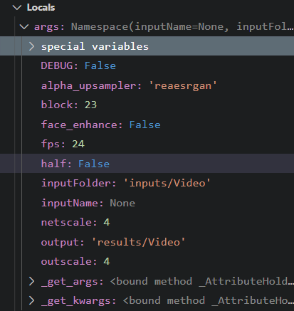

# 对于 inference_realesrgan.py 的研究

使用变量 `img` 来存放图片，`img` 的读取使用OpenCV2的imread方法，`img.shape` 变量初步推测是图像的颜色通道

# 对于argparse模块的研究

通过实例化argparse.ArgumentParser类，作为参数收集器，通过它的parse_args方法获得参数，参数的容器args变量结构如图所示：

